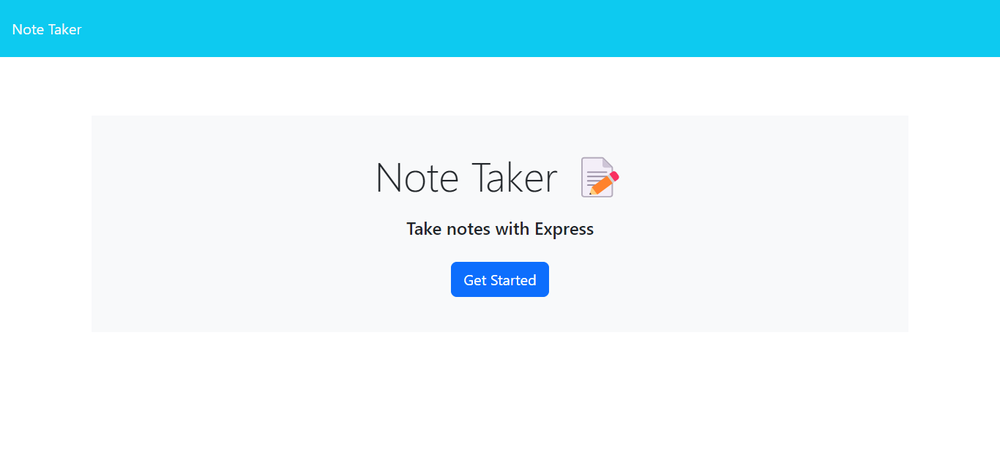

# My-Note-Taker-App

#Note App 
I was asked to use preexisting code to create a note taker app. The app will allow a user the ability to view notes, add new notes and delete already existing notes by the usage of GET, POST and DELETE Routes.

## Installation

1. I used HTML, CSS AND JavaScript.
2. Additionally I made use of the following node packages.:
    1. Express-For creation of API Routes
    2. utils-For installations of modules for my project.
    3. uuid-For unique user identification
    4. nodemon-For the quick restart of my server.
1. I deployed my project using render. A link and screenshot are provided below:
    1. render url: https://my-note-taker-app-1.onrender.com/
    2. Deployed Site Screenshot: 

## Usage
This application is a note taker that will allow a user to GET, POST and DELETE notes from a UI.
```

## Contributing
There were two contributors to this project with me being the primary one and one of my classmates providing advice:
1. Samuel Wlodawski
2. Andres Albornez

## License

I employed no license in the creation of this project.